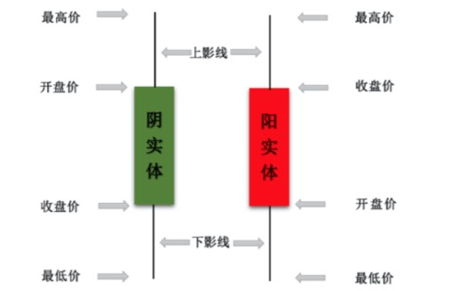

# K 线图

> K 线图是图表中的一种，也叫蜡烛图，包括 `开市价`、`收市价`、`最高价`、`最低价`，阳烛(红色实心)代表当上涨市，阴烛(绿色或空心)代表下跌市

- ① 红色代表上涨：开盘价在收盘价 **下** 方，自然是涨了
- ② 绿色(黑色/空心)代表下跌：开盘价在收盘价 **上** 方，自然是跌了
- ③ 柱体越长表示价格变动越大
- ④ 没有柱体表示 `开盘价=收盘价`
- ⑤ 影线表示买卖双方对价格的影响
  > 比如上影线表示，有一段时间最高价高于收盘价，但是由于`卖的人比买的人多(供大于求)`，因此价格下跌了一部分

## 不同的 K 线组合

上边介绍了基本概念，那么具体的 K 线，在实际运用中就需要看多根 K 线，不同时期形成的 K 线了。由此，就有不同的形态，比如：双顶(底)，圆弧顶(底)，(上升/下降)旗型，三角型等等

因此，看 K 线不是单看一根 K 线的，要从一个阶段来分析，上升，顶部，下跌，底部，还是中序震荡，看清阶段有利于分析 K 线的走势

## K 线周期

在操盘软件中都可以选择 K 线的周期，比如：日 K，周 K，月 K，在分时中还可选 1 分钟 K 线，5 分钟 K 线等。那么这些 K 线周期反应不同周期的形态了

- 周 K，月 K：是看趋势，一支股票是在上涨，还是下跌，或者横盘，从较长周期的 K 线去看，更清晰明确，**中长期趋势**
- 日 K，分时：是看波动，资金的博弈，是近期感知多空的选择，**短期趋势**

注意：不管什么 K 线，MACD，PE 等等各种指标，都是辅助，**前提都是市场趋势**，市场环境趋好，那才有意义，如大环境都不好，你买再好的股票，再优的价格还是会下跌

## 交易量/筹码

只单看 K 线，其实是不够的，还**需要结合交易量**，**筹码分布**等多个指标，才能更准确的分析出结果

## 参考

- [「股票 k 线图」是指什么，如何理解与分析？](https://www.zhihu.com/question/384284743/answer/1145758811)
- [K 线图怎么看，有什么意义？](https://www.zhihu.com/question/294718830/answer/492073503)
- [K 线](https://www.bilibili.com/video/BV1ib411i7jg?p=4)
- [从零开始学炒股](https://www.bilibili.com/video/BV1D7411m7VV?p=3)
